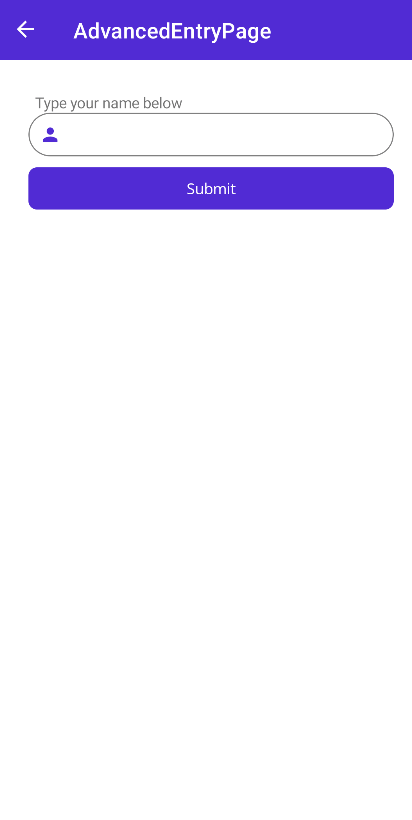

# InputKit: FormView
FormView is a control that contains other validatable controls. Making validation and showing validation messages never been easy before. It checks all the validatable objects inside and prevents form submitting if one of them is not valid.


## Usage

FormView is a control that can be placed anywhere in a layout in your application. It defines an attached property named `IsSubmitButton` that can be set to true for any button inside the form. When the button is clicked, the form will be validated and if it is valid, the form will be submitted. If the form is not valid, the validation messages will be shown. `SubmitCommand` will be executed when form is valid and submitted.

```xml
<input:FormView SubmitCommand="{Binding SubmitCommand">
    
    <!-- ... -->
    
    <Button Text="Submit" input:FormView.IsSubmitButton="True" />
</input:FormView>
```

## Validations

Validations are implemented to controls by `IValidatable` interface. This interface contains List of `IValidation`. So, multiple validations can be applied to a single control. `IValidation` interface has a `Validate` method that returns `bool` as validation result. This method is called when the form is submitted. If the result is `false`, the validation message will be shown.

There are some built-in validations that can be used in your application. They are:

  * `RequiredValidation` - Checks if the value is not null or empty.
  * `RegexValidation` - Checks if the value matches the given regex pattern.
  * `MinLengthValidation` - Checks if the string length is greater than or equal to the given length.
  * `MaxLengthValidation` - Checks if the string length is less than or equal to the given length.
  * `MaxValueValidation` - Checks if the value is less than or equal to the given value.
  * `MinValueValidation` - Checks if the value is greater than or equal to the given value.
  * `NumericValidation` - Checks if the value is a number.
  * `DigitsOnlyValidation` - Checks if the value contains only digits.
  * `LettersOnlyValidation` - Checks if the value contains only letters.

Built-in validations are implemented in `InputKit.Shared.Validations` namespace. You can use them in your application like this:

```xml
xmlns:validation="clr-namespace:InputKit.Shared.Validations;assembly=InputKit.Maui"
```

```xml
<input:FormView>
    <input:AdvancedEntry Title="Type your name below">
        <input:AdvancedEntry.Validations>
            <validation:RequiredValidatation />
            <validation:MinLengthValidation MinLength="5" />
        </input:AdvancedEntry.Validations>
    </input:AdvancedEntry>
    <Button Text="Submit" input:FormView.IsSubmitButton="True" />
</input:FormView>
```




Also, each message can be cusomized by setting `Message` property of validation. So you can use your own localization logic in validation messages.

```xml
<input:AdvancedEntry.Validations>
    <validation:RequiredValidatation Message="Questo campo è obbligatorio" />
</input:AdvancedEntry.Validations>
```


### Creating a Custom Validation

You can create your own validation by implementing `IValidation` interface. It has a `Validate` method that takes a `object` as parameter and returns `bool` as result. The parameter is the value of the control that the validation is applied to. The result is the validation result. If the result is `false`, the validation message will be shown.

```csharp

public class MyEmailValidation : IValidation
{
    public string Message { get; set; } = "Please enter a valid email address.";

    public bool Validate(object value)
    {
        if (value is string text)
        {
            return text.Count(x => x == '@') == 1 && text.Split('@').Last().Length >= 2;
        }
        return false;
    }
}
```

Then you can use your custom validations in inputs like this:

```xml
<input:FormView>
    <input:AdvancedEntry Title="Type your name below">
        <input:AdvancedEntry.Validations>
            <local:MyEmailValidation />
        </input:AdvancedEntry.Validations>
    </input:AdvancedEntry>
    <Button Text="Submit" input:FormView.IsSubmitButton="True" />
</input:FormView>
```